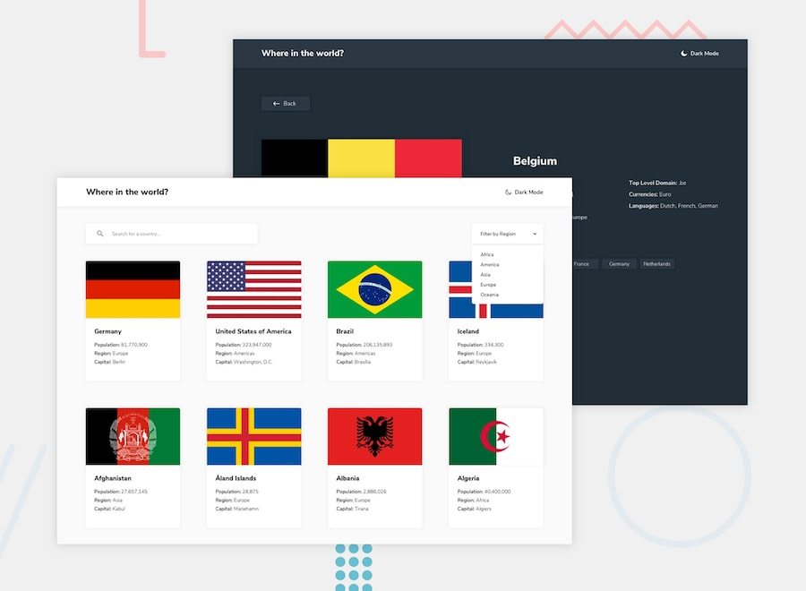

# Rest Countries API Challenge

## Table of Contents
- [Description](#description)
- [Demo](#demo)
- [Technologies Used](#technologies-used)
- [Features](#features)
- [Installation](#installation)
- [Usage](#usage)
- [Live Site](#live-site)
- [Screenshots](#screenshots)
- [Contributing](#contributing)
- [Contact](#contact)

## Description

A React application that utilizes the Rest Countries API to display information about different countries. The app includes a theme switcher that allows users to switch between light and dark themes.

## Demo

## Technologies Used

- React
- React Router DOM
- REST Countries API
- CSS

## Features

- View a list of countries with details like name, population, region, etc.
- Search for specific countries by name.
- Filter countries by region.
- Toggle between light and dark themes.

## Installation

1. Clone the repository: `git clone https://github.com/MundatiC/rest-countries-api.git`
2. Navigate to the project directory: `cd rest-countries-api`
3. Install dependencies: `npm install`

## Usage

1. Start the development server: `npm start`
2. Open your browser and go to: `http://localhost:3000`

## Live Site

Check out the live site [here](https://mundatic.github.io/rest-countries-api/).

## Screenshots

### Desktop View

### Mobile View

## Contributing

Contributions are welcome! If you find any bugs or have suggestions for new features, please open an issue or submit a pull request.

## Contact

If you have any questions or need further assistance, feel free to contact me:

- Email: calebngethe230@gmail.com
- GitHub: [Your GitHub Profile](https://github.com/MundatiC)
- LinkedIn: [caleb-mundati](https://www.linkedin.com/in/caleb-mundati/)
